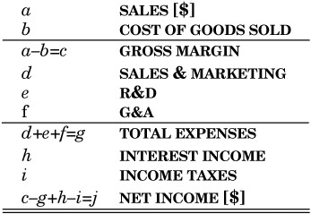

# ~~TWELVE~~ BASIC PRINCIPLES
Accountants have some basic rules and assumptions upon which rest all their work in preparing financial statements.

## Contextual Definition
For US, FASB (Financial Accounting Standards Board) makes these rules & termed as GAAP(Generally Accepted Accounting Principles). FASB is made up of CPAs (Certified Public Accountants). Made up of 12 principles.

For India, MCA(Ministry of Corporate Affairs) makes these rules & term it as Indian GAAP. Made up of 10 principles. However IFRS(International Financial Reporting Standards) is also prevalent which is prepared by IASB(International Accounting Standards Board). Made up of [17 principles](http://www.ifrs.org/issued-standards/list-of-standards/)

## GAAP

1. **Accounting Entity**
  - The accounting entity is the business unit (regardless of the legal business form) for which the financial statements are being prepared.
  - The accounting entity principle states that there is a “business entity” separate from its owners…a fictional “person” called a company for which the books are written.
2. **Going Concern**
  - Unless there is evidence to the contrary, accountants assume that the life of the business entity is infinitely long.
  - Greatly simplify the preparation of financial statements.
  - If during the review of a corporation’s books, the accountant has reason to believe that the company may go bankrupt, he must issue a “qualified opinion” stating the potential of the company’s demise
3. **Measurement**
 - Accounting deals with things that can be quantified—resources and obligations upon which there is an agreed-upon value
 - Accounting only deals with things that can be measured.
 - This leaves out loyal customers among other things
 - Financial statements contain only the quantifiable estimates of assets (what the business owns) and liabilities (what the business owes)
4. **Units of Measure** U.S. dollars are the units of value reported in the financial statements of U.S. companies.
5. **Historical Cost** What a company owns and what it owes are recorded at their original (historical) cost with no adjustment for inflation.
6. **Materiality**
  - Materiality refers to the relative importance of different financial information.
  - But all transactions must be reported if they would materially affect the financial condition of the company.
  - Materiality is a straightforward judgment call.
7. **Estimates and Judgments**
  - Complexity and uncertainty make any measurement less than exact. Estimates and judgments must often be made for financial reporting. It is okay to guess if:
    - that is the best you can do
    - the expected error would not matter much anyway.
  - But accountants should use the same guessing method for each period
8. **Consistency**
  - The principle of consistency states that each individual enterprise must choose a single method of reporting and use it consistently over time
9. **Conservatism**
  - Accountants have a downward measurement bias, preferring understatement to overvaluation
10. **Periodicity** Accountants assume that the life of a corporation can be divided into periods of time for which profits and losses can be reported, usually a month, quarter or year.
11. **Substance Over Form**
  - Accountants report the economic “substance” of a transaction rather than just its form.
  - An equipment lease that is really a purchase dressed in a costume, is booked as a purchase
  - Importance of lines
      - Single lines on a financial statement indicate that a calculation has been made on the numbers just preceding in the column.
      - The double underline is saved for the last. That is, use of a double underline signifies the very last amount in the statement.
  
12. **Accrual Basis of Presentation**
  - In accrual accounting, if a business action in a period makes money, then all its product costs and its business expenses should be reported in that period
  - documentation is accomplished by matching for presentation:
      - the revenue received in selling product
      - the costs to make that specific product sold
  - Key to accrual accounting is determining
      1. when you may report a sale on the financial statements
        - Revenue is recorded when the product is shipped
        - a sale is recorded when all the necessary activities to provide the good or service have been completed regardless of when cash changes hands
      2. matching and then reporting the appropriate costs of products sold
        - COGS are recorded at the same time the matching revenue is recorded
      3. using a systematic and rational method allocating all the other costs of being in business for the period
        - each month can be charged with one-twelfth of the general business insurance policy even though the policy was paid in full at the beginning of the year
        - Other expenses are recorded when they arise

Note that all businesses with inventory must use the accrual basis of accounting. Other businesses may use a “cash basis” if they desire. Cash basis financial statements are just like the Cash Flow Statement or a simple checkbook.
