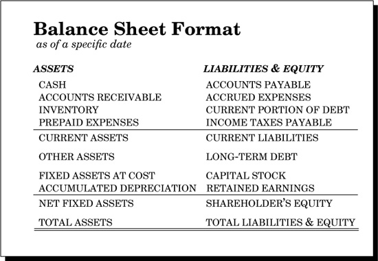

# BALANCE SHEET

- One of the 2 main part of FS
- Basic equation of accounting
  ` Assets - Liabilities  = Worth `
- Balance Sheet equation
  ` Assets = Liabilities + Worth `
- Both “net worth” and “book value” mean the same thing as shareholders’ equity
- Addition in LHS (Assets) should be balanced by addition of RHS (Liabilities or Worth or both) 
- Balance Sheet is a snapshot of time
```
Assets:= Has Today
Liabilities:= Owes Today
Equity:= Worth Today
```

## Assets
- Assets are everything you’ve got—cash in the bank, inventory, machines, buildings—all of it
- Assets are also certain “rights” you own that have a monetary value…like the right to collect cash from customers who owe you money
- Assets are valuable and this value must be *quantifiable* (GAAP : Measurement) for an asset to be listed on the Balance Sheet
- Assets are grouped for presentation on the Balance Sheet according to their characteristics:
  - **very liquid assets** cash and securities
  `liquidity : the ease of convertibility into cash`
  - **productive assets** plant and machinery
  - **assets for sale** inventory
  - **Accounts receivable** are a special type of asset group—the obligations of customers of a company(called account) to pay the company for goods shipped to them on credit
- Assets are displayed in the asset section of the Balance Sheet in the descending order of liquidity
- Asset Types
  1. **Current Assets** [E]
  -  those assets that are expected to be converted into cash in less than 12 months. Listing order
    - CASH [A]
    - ACCOUNTS RECEIVABLE [B]
    - INVENTORY [C] (Raw Materials, Work-in-process, Finished goods)
    - PREPAID EXPENSES [D] (the enterprise will not have to use cash to pay them in the near future)
  - Current asset cycle of a business
    > cash -> buys inventory -> sold to become account receivable -> collection becomes cash
  2. **Other Assets** [F] catchall category that includes intangible assets such as the value of patents, trade names and so forth
  3. **Fixed Assets**
  - property, plant and equipment, or PP&E
  - *Fixed Assets at Cost* [G] (GAAP : Historical Cost) : reported on the Balance Sheet at original purchased price
  - Depreciation [H] is an accounting convention reporting (on the Income Statement) the decline in useful value of a fixed asset due to wear and tear from use and the passage of time
  - The Net Fixed Assets [I] of a company are the sum of its fixed assets’ purchase prices minus the depreciation charges taken on the Income Statement over the years
  - Total Assets are followed as below
  ```
  E := A + B + C + D
  I := G - H
  J := E + F + I
  ```

## Liabilities and Equity
- Liabilities are economic obligations of the enterprise, such as money that the corporation owes to lenders, suppliers, employees, etc.
- Shareholders’ equity is a very special kind of liability. It represents the value of the corporation that belongs to its owners. However, this “debt” will never be repaid in the normal course of business
- Liabilities Types
  1. **Current Liabilities** [O]
  - bills that must be paid within one year of the date of the Balance Sheet
  - grouped depending on to whom the debt is owed
    - ACCOUNTS PAYABLE [K] owed to suppliers (for materials and equipment bought on credit, that the corporation must pay soon)
    - ACCRUED EXPENSES [L] owed to employees and others for services
    - CURRENT PORTION OF DEBT [M] owed to lenders (any notes payable and the current portion of long-term debt are both components of current liabilities)
    - INCOME TAX PAYABLE [N] owed to the government
  2. **Long Term Debt** [P]
  - A loan with an overall term of more than 12 months from the date of the Balance Sheet.
  - A mortgage on a building is a common example
  - Total Liabilities [U]
    - No representation in Balance Sheets
    - the sum of its current liabilities and its long-term debt
  3. **Shareholders Equity** [S]
  - difference between total assets and total liabilities
  - two components
    - CAPITAL STOCK [Q] original amount of money the owners contributed as their investment
    - RETAINED EARNINGS [R] earnings of the company that are not paid out as dividends to owners
  - The value of shareholders’ equity increases when the company: (1) makes a profit, thereby increasing retained earnings, or (2) sells new stock to investors, thereby increasing capital stock.
  - The value of shareholders’ equity decreases when the company: (1) has a loss, thereby lowering retained earnings, or (2) pays dividends to shareholders, thereby lowering retained earnings
- Total Liabilities & Equity [T] calculation
```
O:= K + L + M + N
S:= Q + R
T:= O + P + S
U:= O + P
S:= J - U
```

## Working Capital
- The cash generated from current assets is used to pay current liabilities as they become due, and the surplus is said as Working Capital
```
Working Capital = Current Assets - Current Liabilities
V:= E - O
```
- amount of money the enterprise has to “work with” in the short-term
- feeds the operations of the enterprise with dollar bills
- called “net current assets” or simply “funds”
- Sources are one or both of:
  - Decrease in current liabilities
  - Increase in current assets
- Sources are ways working capital increases in the normal course of business
- Uses are ways working capital decreases during the normal course of business
- With lots of working capital it will be easy to pay your “current” financial obligations, bills that come due in the next 12 months
