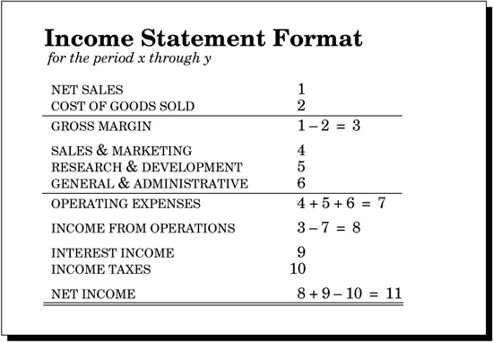

# THE INCOME STATEMENT
- IS is One of the 2 main part of FS
- IS gives one important perspective on the health of a business—its profitability
- IS does not tell the whole picture about a company’s financial health
- IS says nothing about when the company receives cash or how much cash it has on hand
- IS is about the second basic equation of accounting
  `Sales - Cost & Expenses = Income`
- 

## Terminologies

### Net Sales [1]
- **Sales** are recorded on the Income Statement when the company actually ships products to customers (GAAP : Accrual Basis of Presentation)
- Company sends invoice along with the shipping of product.
- The company’s right to collect is called an *account receivable* and is entered on the company’s Balance Sheet.
- **Net sales** means the total amount the company will ultimately collect from a sale—that is, list price less any discounts offered to the customer to induce purchase
- When a *sale* is made, income is generated on the Income Statement whereas *Orders* only increase the “backlog” of products to be shipped and do not have an impact on the Income Statement in any way

### Cost & COGS [2]
- *Costs* are what you spend when you buy (or make) products for inventory like for raw materials, workers’ wages, manufacturing overhead and so forth
- When this inventory is sold, that is, shipped to customers, its total cost is taken out of inventory and entered in the Income Statement as a special type of expense called *cost of goods sold (COGS)*
- Costs lower cash and increase inventory values on the Balance Sheet
- Only when inventory is sold does its value move from the Balance Sheet to the Income Statement as COGS

### Gross Margin [3]
- _Gross margin_ is the amount left over from sales after product COGS are subtracted
- Gross Margin :: Gross Profit :: Manufacturing Profit

### Operating Expenses [7]
- *Expenses* pay for developing and selling products and for running the “general and administrative” aspects of the business like paying legal fees and a sales person’s salary, buying chemicals for the R&D laboratory and so forth
- Grouping of Expenses in IS
    - *Sales & Marketing* [4]
    - *Research & Development* [5]
    - *General & Administrative* [6]
- Expenses directly lower income on the Income Statement
- Operating expenses are those expenditures (that is, cash out) that a company makes to generate income

### Income From Operations[8]
- Profit :: Income
- Income is what's left over after you have subtracted all the cost and expenses from Sales
- IS :: P&L Statement :: Earning Statement
- income from operations refers to what is left over after expenses and costs are subtracted from sales
- Companies can also generate income and have expenses from financial (non-operating) activities. For example, a manufacturing company selling a piece of real estate for a profit

### Non-operating Income & Expense [10]
- Paying interest on a loan is a so-called non-operating expense
- receiving interest on cash balances in the company’s bank account is non-operating income
- A company’s operations can be producing income, but the company as a whole can still show an overall loss. This sad state of affairs comes about when non-operating expenses (such as very high interest expenses) exceed the total operating income

### Net Income [11]
- is the difference between two large numbers: (1) sales and (2) costs plus expenses
- Income is not cash. In fact, a very profitable company with lots of net income can also be insolvent; that is, with no cash left to pay its bills


```
Gross Margin:= Sales - COGS
Operating Expenses:= Sales & Marketing + Research & Development + General & Administrative
Income from Operations:= Gross Margin - Operating Expenses
Net Income:= Income From Operations + Interest Income -  Income Taxes
Non-Operating Expense:= Income Taxes
Non-Operating Income:= Interest Income
```

### Accrual Basis vs. Cash Basis
