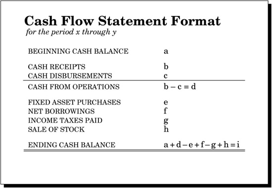

# THE CASH FLOW STATEMENT
- tracks the movement of cash through the business over a period of time
- recording all the company’s transactions that use cash (checks) or supply cash (deposits)
- A positive cash flow for a period means the company has more cash at the end of the period than at the beginning
- A negative cash flow for a period means that the company has less cash at the end of the period than at the beginning
- -ve cash flow => broke...tapped-out...insolvent
 

## Understanding terminologies
- Sources of Cash
  - _Cash Receipts_ [b] Operating activities such as receiving payment from customers
  - Financing activities such as selling stock or borrowing money
- Uses of Cash
  - _Cash Disbursements_ [c] Operating activities such as paying suppliers and employees
  - Financial activities such as paying interest and principal on debt or paying dividends to shareholders
  - Making major capital investments in long-lived productive assets like machines
  - Paying income taxes to the government
- _Cash From Operations_ [d] Cash receipts (money in) minus cash disbursements (money out)
- Cash from operations is a good measure of how well the enterprise is doing in its day-to-day business activities, its so-called operations
- *Fixed Asset Purchase* [e] Money spent to buy property, plant and equipment (PP&E) is an investment in the long-term capability of the company to manufacture and sell product
- *Net Borrowings* [f] The difference between any new borrowings in a period and the amount paid back in the period
- *Income Taxes Paid* [g] Owing income taxes is different from paying them. The business owes some more income tax every time it sells something for a profit
- *Sale of Stock: New Equity* [h] When a company sells stock to investors, it receives money and increases the amount of cash it has on hand
- *Ending Cash Balance* beginning cash on hand, plus cash received, minus cash spent, equals ending cash on hand
```
Cash From Operations:= Cash From Receipts - Cash Disbursements
Ending Cash Balance:= Beginning Cash Balance +
                      Cash From Operations   -
                      Fixed Asset Purchase   +
                      Net Borrowings         -
                      Income Taxes Paid      +
                      Sale of Stock
```

[<< previous](chapter-3.md "The Income Statement")[ next >>](chapter-5.md "Connections")
